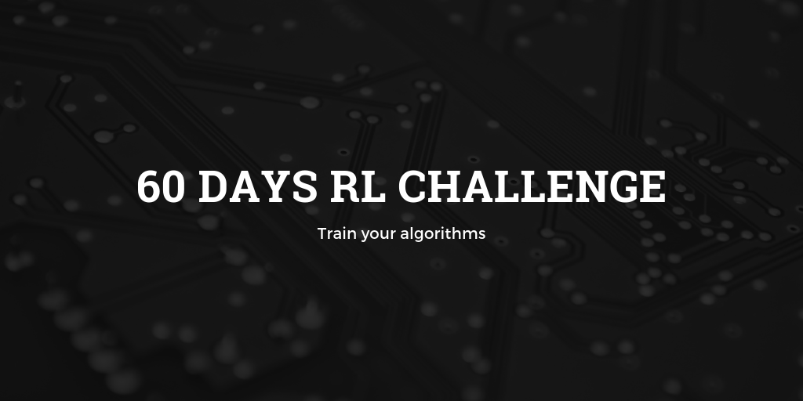

## Welcome in the 60 days RL Challenge!

Hi, I'm finally committed to learn **Reinforcement Learning** in depth, in 60 days!!

**Do you want to take on this challenge with me?**  

Aren't you convinced? Look at the works done by [Deepmind with AlphaGo](https://www.youtube.com/watch?time_continue=24&v=tXlM99xPQC8) and the bot developed by [OpenAI to play Dota 2](https://www.youtube.com/watch?v=l92J1UvHf6M)  

This repository wants to be a place where you can start **learn RL**. It shows you the main road to be taken to **implement highly advanced RL algorithms**. It also provides a start guide, **hands-on projects**, and **in-depth additional resources** to each RL algorithm.

For each well-known RL algorithm like Cross-entropy, MDP, DQN, Actor-Critic and much more, I will share with you a brief theoretical overview of these algorithms and additional material in case you want to study them in more depth. 
Along with the theory, for the major RL techniques, I will provide you with some practical examples to better digest the theory and implement them by yourself.

I really encourage you to take this challenge. 
Also, because this is my first project of this kind, please, if you have any idea, suggestion or improvement contact me at andrea.lonza@gmail.com.

NB: My main resource is the book [Deep Reinforcement Learning Hands-On](https://www.amazon.com/Practical-Reinforcement-Learning-Maxim-Lapan/dp/1788834240)

During the whole challenge, I will continuously update this repository.

60_Days_RL_Challenge
60DaysRLChallenge

 - [ ] 60 days RL Challenge
 - [ ] Chapter 1
 - [ ] Cross entropy project

## Chapters
 1. *Cross entropy*
 2. *Value iteration*
 3. *DQN*
 4. *Actor Critic (A2C)*
 5. *Asynchronous Advantage Actor Critic*
 6. *RL in continuous space*
 7. *TRPO / PPO*
 8. *ES & GA*

## Projects (Yet to decide)
 - Cross entropy
 - DQN
 - AC2
 - ES
 - AlphaGo Zero

## Best RL papers

## Best resources

## Additional resources 
