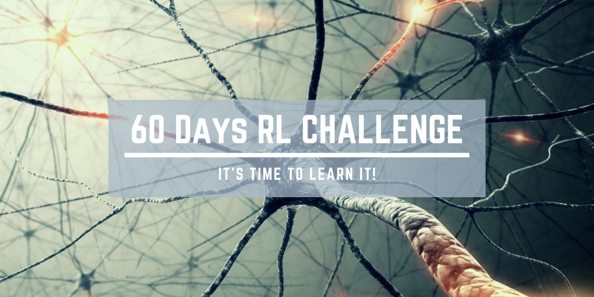

  

 

### I designed this Challenge for you and me: Learn Deep Reinforcement Learning in Depth in 60 days!!

You heard about the amazing results achieved by [Deepmind with AlphaGo Zero](https://www.youtube.com/watch?time_continue=24&v=tXlM99xPQC8) and by [OpenAI in Dota 2](https://www.youtube.com/watch?v=l92J1UvHf6M)! Don't you want to know how they work?
This is the right opportunity for you and me to finally learn Deep RL and use it on new exciting projects.

> The ultimate aim is to use these general-purpose technologies and apply them to all sorts of important real world problems.
> **Demis Hassabis**
 

This repository wants to guide you through the Deep Reinforcement Learning algorithms, from the most basic ones to the highly advanced AlphaGo Zero. You will find the **main topics organized by week** and the **resources suggested to learn them**. Also, every week I will provide **practical examples** implemented in python to help you better digest the theory. You are highly encouraged to modify and play with them!

 

During the whole challenge, I will **update continuously** this repository..

**.. so stay tuned**  
#### #60DaysRLChallenge

Now we have also a [**Slack channel**](https://60daysrlchallenge.slack.com/). To get an invitation, email me at andrea.lonza@gmail.com

This is my first project of this kind, so please, if you have any idea, suggestion or improvement contact me at andrea.lonza@gmail.com.

 

### Prerequisites
* Basic level of Python and PyTorch
* Machine Learning
* Basic knowledge in Deep Learning (MLP, CNN and RNN)

## Projects (Yet to decide)
 - **Q-learning**
 - **DQN**
 - **AC2**
 - **ES**
 - **AlphaGo Zero**

## Week 1 - Introduction

- **[An introduction to Reinforcement Learning](https://www.youtube.com/watch?v=JgvyzIkgxF0) by Arxiv Insights**
- **[Introduction and course overview](https://www.youtube.com/watch?v=Q4kF8sfggoI&index=1&list=PLkFD6_40KJIznC9CDbVTjAF2oyt8_VAe3) - CS294 by Levine**
- **[Deep Reinforcement Learning: Pong from Pixels](http://karpathy.github.io/2016/05/31/rl/) by Karpathy**

 

## Week 2 - RL Basics: *MDP, Dynamic Programming and Model-Free Control*

> Those who cannot remember the past are condemned to repeat it - **George Santayana**

This week, we will learn about the basic blocks of reinforcement learning, starting from the definition of the problem all the way through the estimation and optimization of the functions that are used to express the quality of a policy or state.

----

### Theoretical material

* **[Markov Decision Process](https://www.youtube.com/watch?v=lfHX2hHRMVQ&list=PLzuuYNsE1EZAXYR4FJ75jcJseBmo4KQ9-&index=2)** RL by David Silver
  * Markov Processes
  * Markov Decision Processes

- **[Planning by Dynamic Programming](https://www.youtube.com/watch?v=Nd1-UUMVfz4&list=PLzuuYNsE1EZAXYR4FJ75jcJseBmo4KQ9-&index=3)**  RL by David Silver
  * Policy iteration
  * Value iteration

* **[Model-Free Prediction](https://www.youtube.com/watch?v=PnHCvfgC_ZA&index=4&list=PLzuuYNsE1EZAXYR4FJ75jcJseBmo4KQ9-)**  RL by David Silver
  * Monte Carlo Learning
  * Temporal Difference Learning
  * TD(λ)

- **[Model-Free Control](https://www.youtube.com/watch?v=0g4j2k_Ggc4&list=PLzuuYNsE1EZAXYR4FJ75jcJseBmo4KQ9-&index=5)**  RL by David Silver
  * Ɛ-greedy policy iteration
  * GLIE Monte Carlo Search
  * SARSA
  * Importance Sampling

----

### Project of the Week

[Q-learning applied to FrozenLake](Week2/frozenlake_Qlearning.ipynb). For exercise, you can solve the game using SARSA or implement Q-learning by yourself. In the former case, only few changes are needed.

----

#### To know more
- :books: Read chapters 3,4,5,6,7 of [Reinforcement Learning An Introduction - Sutton, Barto](https://web.stanford.edu/class/psych209/Readings/SuttonBartoIPRLBook2ndEd.pdf)
- :tv: [Value functions introduction](https://www.youtube.com/watch?v=k1vNh4rNYec&index=6&list=PLkFD6_40KJIznC9CDbVTjAF2oyt8_VAe3) - DRL UC Berkley by Sergey Levine

 

## Week 3 - Value Function Approximation and DQN

This week we'll learn more advanced concepts and apply deep neural network to Q-learning algorithms.

----

### Theoretical material

#### Lectures
- **[Value functions approximation](https://www.youtube.com/watch?v=UoPei5o4fps&list=PLqYmG7hTraZDM-OYHWgPebj2MfCFzFObQ&index=6) - RL by David Silver**
  - Differentiable function approximators
  - Incremental methods
  - Batch methods (DQN)

* **[Advanced Q-learning algorithms](https://www.youtube.com/watch?v=nZXC5OdDfs4&list=PLkFD6_40KJIznC9CDbVTjAF2oyt8_VAe3&index=7) - DRL UC Berkley by Sergey Levine**
  - Replay Buffer
  - Double Q-learning
  - Continous actions (NAF,DDPG)
  - Pratical tips

#### Papers

##### Must Read
 - [Playing Atari with Deep Reinforcement Learning](https://arxiv.org/pdf/1312.5602.pdf) - 2013
 - [Human-level control through deep reinforcement learning](https://storage.googleapis.com/deepmind-media/dqn/DQNNaturePaper.pdf) - 2015
 - [Rainbow: Combining Improvements in Deep Reinforcement Learning](https://arxiv.org/pdf/1710.02298.pdf) - 2017

##### Extensions of DQN
 - [Deep Reinforcement Learning with Double Q-learning](https://arxiv.org/pdf/1509.06461.pdf) - 2015
 - [Prioritized Experience Replay](https://arxiv.org/pdf/1511.05952.pdf) - 2015
 - [Dueling Network Architectures for Deep Reinforcement Learning](http://proceedings.mlr.press/v48/wangf16.pdf) - 2016
 - [Noisy networks for exploration](https://arxiv.org/pdf/1706.10295.pdf) - 2017
 - [Distributional Reinforcement Learning with Quantile Regression](https://arxiv.org/pdf/1710.10044.pdf) - 2017

----

### Project of the Week

[**DQN and some variants applied to Pong**](Week3/README.md)

This week the goal is to develop a DQN algorithm to play an Atari game. To make it more interesting I developed three extensions of DQN: **Double Q-learning**, **Multi-step learning**, **Dueling networks** and **Noisy Nets**. Play with them, and if you feel confident, you can implement Prioritized replay, Dueling networks or Distributional RL. To know more about these improvements read the papers!

-----

#### Suggested
  - :tv: [Deep Reinforcement Learning in the Enterprise: Bridging the Gap from Games to Industry](https://www.youtube.com/watch?v=GOsUHlr4DKE)

 

## Week 4 - Policy gradient methods and A2C

Week 4 introduce Policy Gradient methods, a class of algorithms that optimize directly the policy. Also, you'll learn about Actor-Critic algorithms. These algorithms combine both policy gradient (the actor) and value function (the critic).

----

### Theoretical material

#### Lectures

* **[Policy gradient Methods](https://www.youtube.com/watch?v=KHZVXao4qXs&list=PLqYmG7hTraZDM-OYHWgPebj2MfCFzFObQ&index=7) - RL by David Silver**
  - Finite Difference Policy Gradient
  - Monte-Carlo Policy Gradient
  - Actor-Critic Policy Gradient

- **[Policy gradient intro](https://www.youtube.com/watch?v=XGmd3wcyDg8&t=0s&list=PLkFD6_40KJIxJMR-j5A1mkxK26gh_qg37&index=3) - CS294-112 by Sergey Levine (RECAP, optional)**
  - Policy Gradient (REINFORCE and Vanilla PG)
  - Variance reduction

* **[Actor-Critic](https://www.youtube.com/watch?v=Tol_jw5hWnI&list=PLkFD6_40KJIxJMR-j5A1mkxK26gh_qg37&index=4) - CS294-112 by Sergey Levine (More in depth)**
  - Actor-Critic
  - Discout factor
  - Actor-Critic algorithm design (batch mode or online)
  - state-dependent baseline

#### Papers

- [Policy Gradient methods for reinforcement learning with function approximation](https://papers.nips.cc/paper/1713-policy-gradient-methods-for-reinforcement-learning-with-function-approximation.pdf)
- [Asynchronous Methods for Deep Reinforcement Learning](https://arxiv.org/pdf/1602.01783.pdf)

---

### Project of the Week

[**Vanilla PG and A2C**](Week4)
The exercise of this week is to implement a policy gradient method or a more sophisticated actor-critic. In the repository you can find an implemented version of PG and A2C. Pay attention that A2C give me strange result. You can try to make it works or implement an [asynchronous version of A2C (A3C)](https://arxiv.org/pdf/1602.01783.pdf).

---

#### Suggested
  - :books: [Intuitive RL: Intro to Advantage-Actor-Critic (A2C)](https://hackernoon.com/intuitive-rl-intro-to-advantage-actor-critic-a2c-4ff545978752)
  - :books: [Asynchronous Actor-Critic Agents (A3C)](https://medium.com/emergent-future/simple-reinforcement-learning-with-tensorflow-part-8-asynchronous-actor-critic-agents-a3c-c88f72a5e9f2)

 

## Week 5 - Advanced Policy Gradients - TRPO & PPO

This week is about advanced policy gradient methods that improve the stability and the convergence of the "Vanilla" policy gradient methods. You'll learn and implement PPO, a RL algorithm developed by OpenAI and adopted in [OpenAI Five](https://blog.openai.com/openai-five/).

----

### Theoretical material

#### Lectures

- **[Advanced policy gradients](https://www.youtube.com/watch?v=ycCtmp4hcUs&t=0s&list=PLkFD6_40KJIznC9CDbVTjAF2oyt8_VAe3&index=15) - CS294-112 by Sergey Levine**
  - Problems with "Vanilla" Policy Gradient Methods
  - Policy Performance Bounds
  - Monotonic Improvement Theory
  - Algorithms: NPO, TRPO, PPO

* **[Natural Policy Gradients, TRPO, PPO](https://www.youtube.com/watch?v=xvRrgxcpaHY) - John Schulman, Berkey DRL Bootcamp - (RECAP, optional)**
  * Limitations of "Vanilla" Policy Gradient Methods
  * Natural Policy Gradient
  * Trust Region Policy Optimization, TRPO
  * Proximal Policy Optimization, PPO

#### Papers

- [Trust Region Policy Optimization](https://arxiv.org/pdf/1502.05477.pdf) - 2015
- [Proximal Policy Optimization Algorithms](https://arxiv.org/pdf/1707.06347.pdf) - 2017

---

### Project of the Week

This week, you have to implement PPO or TRPO. I suggest PPO given its simplicity (compared to TRPO). In the project folder [**Week5**](Week5) you can find an implementation of [**PPO that learn to play BipedalWalker**](Week5).
Furthermore, in the folder you can find other resources that will help you in the development of the project. Have fun!

NB: the hyperparameters of the PPO implementation I released, can be tuned to improve the convergence.

---

#### Suggested
  - :books: To better understand PPO and TRPO: [The Pursuit of (Robotic) Happiness](https://towardsdatascience.com/the-pursuit-of-robotic-happiness-how-trpo-and-ppo-stabilize-policy-gradient-methods-545784094e3b)
  - :tv: [Nuts and Bolts of Deep RL](https://www.youtube.com/watch?v=8EcdaCk9KaQ&)
  - :books: PPO best practice: [Training with Proximal Policy Optimization](https://github.com/Unity-Technologies/ml-agents/blob/master/docs/Training-PPO.md)

 

## Week 6 - Evolution Strategies and Genetic Algorithms

## Week 7 - Model Based reinforcement learning - I2A

## Week 8 - AlphaGoZero + Bonus

## Last 4 days - Review + sharing

## Best RL papers

## Best resources

:tv: [Deep Reinforcement Learning](https://www.youtube.com/playlist?list=PLkFD6_40KJIznC9CDbVTjAF2oyt8_VAe3) - UC Berkeley class by Levine, check [here](http://rail.eecs.berkeley.edu/deeprlcourse/) their site.

:tv: [Reinforcement Learning course](https://www.youtube.com/watch?v=2pWv7GOvuf0&list=PLqYmG7hTraZDM-OYHWgPebj2MfCFzFObQ) - by David Silver, DeepMind. Great introductory lectures by Silver, a lead researcher on AlphaGo. They follow the book Reinforcement Learning by Sutton & Barto.

:notebook: [Reinforcement Learning: An Introduction](https://www.amazon.com/Reinforcement-Learning-Introduction-Adaptive-Computation/dp/0262193981/ref=sr_1_2?s=books&ie=UTF8&qid=1535898372&sr=1-2&keywords=reinforcement+learning+sutton) - by Sutton & Barto. The "Bible" of reinforcement learning. [Here](https://drive.google.com/file/d/1opPSz5AZ_kVa1uWOdOiveNiBFiEOHjkG/view) you can find the PDF draft of the second version.

## Additional resources

:books: [Awesome Reinforcement Learning](https://github.com/aikorea/awesome-rl). A curated list of resources dedicated to reinforcement learning
