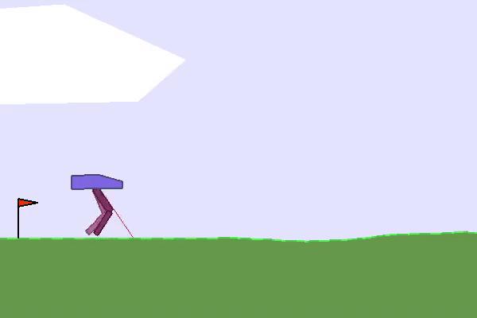

## Course in Deep Reinforcement Learning

### Explore the combination of neural network and reinforcement learning. Algorithms and examples in Python & PyTorch

Have you heard about the amazing results achieved by [Deepmind with AlphaGo Zero](https://www.youtube.com/watch?time_continue=24&v=tXlM99xPQC8) and by [OpenAI in Dota 2](https://www.youtube.com/watch?v=l92J1UvHf6M)? It's all about deep neural networks and reinforcement learning. Do you want to know more about it?  
This is the right opportunity for you to finally learn Deep RL and use it on new and exciting projects and applications.  

Here you'll find an in depth introduction to these algorithms. Among which you'll learn q learning, deep q learning, PPO, actor critic, and implement them using Python and PyTorch.

> The ultimate aim is to use these general-purpose technologies and apply them to all sorts of important real world problems.
> **Demis Hassabis**

This repository contains:  

 

 **Lectures (& other content) primarily from DeepMind and Berkley Youtube's Channel.**

 

 **Algorithms (like DQN, A2C, and PPO) implemented in PyTorch and tested on OpenAI Gym: RoboSchool & Atari.**

 
 

**Stay tuned and follow me on**  and    **#60DaysRLChallenge**

Now we have also a [**Slack channel**](https://60daysrlchallenge.slack.com/). To get an invitation, email me at andrea.lonza@gmail.com. Also, email me if you have any idea, suggestion or improvement.  

To learn Deep Learning, Computer Vision or Natural Language Processing check my **[1-Year-ML-Journey](https://github.com/andri27-ts/1-Year-ML-Journey)**

### Before starting.. Prerequisites
* Basic level of Python and PyTorch
* [Machine Learning](https://github.com/andri27-ts/1-Year-ML-Journey)
* [Basic knowledge in Deep Learning (MLP, CNN and RNN)](https://assoc-redirect.amazon.com/g/r/https://amzn.to/2N3AIlp?tag=andreaaffilia-20)

## A cup of Coffe :coffee:

Any contribution is higly appreciated! Cheers!

  

## Index - Reinforcement Learning
 
 - [Week 1 - **Introduction**](https://github.com/andri27-ts/60_Days_RL_Challenge#week-1---introduction)
 - [Week 2 - **RL Basics**](https://github.com/andri27-ts/60_Days_RL_Challenge#week-2---rl-basics-mdp-dynamic-programming-and-model-free-control)
 - [Week 3 - **Value based algorithms - DQN**](https://github.com/andri27-ts/60_Days_RL_Challenge#week-3---value-function-approximation-and-dqn)
 - [Week 4 - **Policy gradient algorithms - REINFORCE & A2C**](https://github.com/andri27-ts/60_Days_RL_Challenge#week-4---policy-gradient-methods-and-a2c)
 - [Week 5 - **Advanced Policy Gradients - PPO**](https://github.com/andri27-ts/60_Days_RL_Challenge#week-5---advanced-policy-gradients---trpo--ppo)
 - [Week 6 - **Evolution Strategies and Genetic Algorithms - ES**](https://github.com/andri27-ts/60_Days_RL_Challenge#week-6---evolution-strategies-and-genetic-algorithms)
 - [Week 7 - **Model-Based reinforcement learning - MB-MF**](https://github.com/andri27-ts/60_Days_RL_Challenge#week-7---model-based-reinforcement-learning)
 - [Week 8 - **Advanced Concepts and Project Of Your Choice**](https://github.com/andri27-ts/60_Days_RL_Challenge/blob/master/README.md#week-8---advanced-concepts-and-project-of-your-choice)
 - [Last 4 days - **Review + Sharing**](https://github.com/andri27-ts/60_Days_RL_Challenge/blob/master/README.md#last-4-days---review--sharing)
 - [Best resources](https://github.com/andri27-ts/60_Days_RL_Challenge#best-resources)
 - [Additional resources](https://github.com/andri27-ts/60_Days_RL_Challenge#additional-resources)
 

## Week 1 - Introduction

- **[Why is Reinforcement Learning such an important learning method - A simple explanation](https://medium.com/@andrea.lonzats/the-learning-machines-fb922e539335)**
- **[Introduction and course overview](https://www.youtube.com/watch?v=Q4kF8sfggoI&index=1&list=PLkFD6_40KJIznC9CDbVTjAF2oyt8_VAe3) - CS294 by Levine, Berkley**
- **[Deep Reinforcement Learning: Pong from Pixels](http://karpathy.github.io/2016/05/31/rl/) by Karpathy**

##

#### Other Resources

- :books: [The "Bible" of Reinforcement Learning: Chapter 1](https://assoc-redirect.amazon.com/g/r/https://amzn.to/2HRSSmh?tag=andreaaffilia-20) - Sutton & Barto
- Great introductory paper: [Deep Reinforcement Learning: An Overview](https://www.groundai.com/project/deep-reinforcement-learning-an-overview/)
- Start coding: [From Scratch: AI Balancing Act in 50 Lines of Python](https://towardsdatascience.com/from-scratch-ai-balancing-act-in-50-lines-of-python-7ea67ef717)

 

## Week 2 - RL Basics: *MDP, Dynamic Programming and Model-Free Control*

> Those who cannot remember the past are condemned to repeat it - **George Santayana**

This week, we will learn about the basic blocks of reinforcement learning, starting from the definition of the problem all the way through the estimation and optimization of the functions that are used to express the quality of a policy or state.

##

### Lectures - Theory  

* **[Markov Decision Process](https://www.youtube.com/watch?v=lfHX2hHRMVQ&list=PLzuuYNsE1EZAXYR4FJ75jcJseBmo4KQ9-&index=2) - David Silver (DeepMind)**
  * Markov Processes
  * Markov Decision Processes

- **[Planning by Dynamic Programming](https://www.youtube.com/watch?v=Nd1-UUMVfz4&list=PLzuuYNsE1EZAXYR4FJ75jcJseBmo4KQ9-&index=3) - David Silver (DeepMind)**
  * Policy iteration
  * Value iteration

* **[Model-Free Prediction](https://www.youtube.com/watch?v=PnHCvfgC_ZA&index=4&list=PLzuuYNsE1EZAXYR4FJ75jcJseBmo4KQ9-) - David Silver (DeepMind)**
  * Monte Carlo Learning
  * Temporal Difference Learning
  * TD(λ)

- **[Model-Free Control](https://www.youtube.com/watch?v=0g4j2k_Ggc4&list=PLzuuYNsE1EZAXYR4FJ75jcJseBmo4KQ9-&index=5) - David Silver (DeepMind)**
  * Ɛ-greedy policy iteration
  * GLIE Monte Carlo Search
  * SARSA
  * Importance Sampling

##

### Project of the Week - [**Q-learning**](Week2/frozenlake_Qlearning.ipynb) 

[**Q-learning applied to FrozenLake**](Week2/frozenlake_Qlearning.ipynb) - For exercise, you can solve the game using SARSA or implement Q-learning by yourself. In the former case, only few changes are needed.

##

#### Other Resources
- :books: [The "Bible" of Reinforcement Learning: Chapters 3 and 4](https://assoc-redirect.amazon.com/g/r/https://amzn.to/2HRSSmh?tag=andreaaffilia-20) - Sutton & Barto
- :tv: [Value functions introduction](https://www.youtube.com/watch?v=k1vNh4rNYec&index=6&list=PLkFD6_40KJIznC9CDbVTjAF2oyt8_VAe3) - DRL UC Berkley by Sergey Levine

 

## Week 3 - Value based algorithms - DQN

This week we'll learn more advanced concepts and apply deep neural network to Q-learning algorithms.

##

### Lectures - Theory  

- **[Value functions approximation](https://www.youtube.com/watch?v=UoPei5o4fps&list=PLqYmG7hTraZDM-OYHWgPebj2MfCFzFObQ&index=6) - David Silver (DeepMind)**
  - Differentiable function approximators
  - Incremental methods
  - Batch methods (DQN)

* **[Advanced Q-learning algorithms](https://www.youtube.com/watch?v=nZXC5OdDfs4&list=PLkFD6_40KJIznC9CDbVTjAF2oyt8_VAe3&index=7) - Sergey Levine (UC Berkley)**
  - Replay Buffer
  - Double Q-learning
  - Continous actions (NAF,DDPG)
  - Pratical tips

##

### Project of the Week - [**DQN and variants**](Week3) 

 

[**DQN and some variants applied to Pong**](Week3) - This week the goal is to develop a DQN algorithm to play an Atari game. To make it more interesting I developed three extensions of DQN: **Double Q-learning**, **Multi-step learning**, **Dueling networks** and **Noisy Nets**. Play with them, and if you feel confident, you can implement Prioritized replay, Dueling networks or Distributional RL. To know more about these improvements read the papers!

 

##

#### Papers

##### Must Read
 - [Playing Atari with Deep Reinforcement Learning](https://arxiv.org/pdf/1312.5602.pdf) - 2013
 - [Human-level control through deep reinforcement learning](https://storage.googleapis.com/deepmind-media/dqn/DQNNaturePaper.pdf) - 2015
 - [Rainbow: Combining Improvements in Deep Reinforcement Learning](https://arxiv.org/pdf/1710.02298.pdf) - 2017

##### Extensions of DQN
 - [Deep Reinforcement Learning with Double Q-learning](https://arxiv.org/pdf/1509.06461.pdf) - 2015
 - [Prioritized Experience Replay](https://arxiv.org/pdf/1511.05952.pdf) - 2015
 - [Dueling Network Architectures for Deep Reinforcement Learning](http://proceedings.mlr.press/v48/wangf16.pdf) - 2016
 - [Noisy networks for exploration](https://arxiv.org/pdf/1706.10295.pdf) - 2017
 - [Distributional Reinforcement Learning with Quantile Regression](https://arxiv.org/pdf/1710.10044.pdf) - 2017
 
#### Other Resources
  - :books: [The "Bible" of Reinforcement Learning: Chapters 5 and 6](https://assoc-redirect.amazon.com/g/r/https://amzn.to/2HRSSmh?tag=andreaaffilia-20) - Sutton & Barto
  - :tv: [Deep Reinforcement Learning in the Enterprise: Bridging the Gap from Games to Industry](https://www.youtube.com/watch?v=GOsUHlr4DKE)

 

## Week 4 - Policy gradient algorithms - REINFORCE & A2C

Week 4 introduce Policy Gradient methods, a class of algorithms that optimize directly the policy. Also, you'll learn about Actor-Critic algorithms. These algorithms combine both policy gradient (the actor) and value function (the critic).

##

### Lectures - Theory  

* **[Policy gradient Methods](https://www.youtube.com/watch?v=KHZVXao4qXs&list=PLqYmG7hTraZDM-OYHWgPebj2MfCFzFObQ&index=7) - David Silver (DeepMind)**
  - Finite Difference Policy Gradient
  - Monte-Carlo Policy Gradient
  - Actor-Critic Policy Gradient

- **[Policy gradient intro](https://www.youtube.com/watch?v=XGmd3wcyDg8&t=0s&list=PLkFD6_40KJIxJMR-j5A1mkxK26gh_qg37&index=3) - Sergey Levine (RECAP, optional)**
  - Policy Gradient (REINFORCE and Vanilla PG)
  - Variance reduction

* **[Actor-Critic](https://www.youtube.com/watch?v=Tol_jw5hWnI&list=PLkFD6_40KJIxJMR-j5A1mkxK26gh_qg37&index=4) - Sergey Levine (More in depth)**
  - Actor-Critic
  - Discout factor
  - Actor-Critic algorithm design (batch mode or online)
  - state-dependent baseline

##

### Project of the Week - [**Vanilla PG and A2C**](Week4) 

[**Vanilla PG and A2C applied to CartPole**](Week4) - The exercise of this week is to implement a policy gradient method or a more sophisticated actor-critic. In the repository you can find an implemented version of [PG and A2C](Week4). Bug Alert! Pay attention that A2C give me strange result. 
If you find the implementation of PG and A2C easy, you can try with the [asynchronous version of A2C (A3C)](https://arxiv.org/pdf/1602.01783.pdf).

##

#### Papers

- [Policy Gradient methods for reinforcement learning with function approximation](https://papers.nips.cc/paper/1713-policy-gradient-methods-for-reinforcement-learning-with-function-approximation.pdf)
- [Asynchronous Methods for Deep Reinforcement Learning](https://arxiv.org/pdf/1602.01783.pdf)

#### Other Resources
  - :books: [The "Bible" of Reinforcement Learning: Chapters 9 and 10](https://assoc-redirect.amazon.com/g/r/https://amzn.to/2HRSSmh?tag=andreaaffilia-20) - Sutton & Barto
  - :books: [Intuitive RL: Intro to Advantage-Actor-Critic (A2C)](https://hackernoon.com/intuitive-rl-intro-to-advantage-actor-critic-a2c-4ff545978752)
  - :books: [Asynchronous Actor-Critic Agents (A3C)](https://medium.com/emergent-future/simple-reinforcement-learning-with-tensorflow-part-8-asynchronous-actor-critic-agents-a3c-c88f72a5e9f2)

 

## Week 5 - Advanced Policy Gradients - PPO

This week is about advanced policy gradient methods that improve the stability and the convergence of the "Vanilla" policy gradient methods. You'll learn and implement PPO, a RL algorithm developed by OpenAI and adopted in [OpenAI Five](https://blog.openai.com/openai-five/).

##

### Lectures - Theory  

- **[Advanced policy gradients](https://www.youtube.com/watch?v=ycCtmp4hcUs&t=0s&list=PLkFD6_40KJIznC9CDbVTjAF2oyt8_VAe3&index=15) - Sergey Levine (UC Berkley)**
  - Problems with "Vanilla" Policy Gradient Methods
  - Policy Performance Bounds
  - Monotonic Improvement Theory
  - Algorithms: NPO, TRPO, PPO

* **[Natural Policy Gradients, TRPO, PPO](https://www.youtube.com/watch?v=xvRrgxcpaHY) - John Schulman (Berkey DRL Bootcamp)** - (RECAP, optional)
  * Limitations of "Vanilla" Policy Gradient Methods
  * Natural Policy Gradient
  * Trust Region Policy Optimization, TRPO
  * Proximal Policy Optimization, PPO

##

### Project of the Week - [**PPO**](Week5) 

 

[**PPO applied to BipedalWalker**](Week5) - This week, you have to implement PPO or TRPO. I suggest PPO given its simplicity (compared to TRPO). In the project folder Week5 you find an implementation of [**PPO that learn to play BipedalWalker**](Week5).
Furthermore, in the folder you can find other resources that will help you in the development of the project. Have fun!

 

To learn more about PPO read the [paper](https://arxiv.org/pdf/1707.06347.pdf) and take a look at the [Arxiv Insights's video](https://www.youtube.com/watch?v=5P7I-xPq8u8)

##

#### Papers

- [Trust Region Policy Optimization](https://arxiv.org/pdf/1502.05477.pdf) - 2015
- [Proximal Policy Optimization Algorithms](https://arxiv.org/pdf/1707.06347.pdf) - 2017

#### Other Resources
  - :books: To better understand PPO and TRPO: [The Pursuit of (Robotic) Happiness](https://towardsdatascience.com/the-pursuit-of-robotic-happiness-how-trpo-and-ppo-stabilize-policy-gradient-methods-545784094e3b)
  - :tv: [Nuts and Bolts of Deep RL](https://www.youtube.com/watch?v=8EcdaCk9KaQ&)
  - :books: PPO best practice: [Training with Proximal Policy Optimization](https://github.com/Unity-Technologies/ml-agents/blob/master/docs/Training-PPO.md)
  - :tv: [Explanation of the PPO algorithm by Arxiv Insights](https://www.youtube.com/watch?v=5P7I-xPq8u8)

 

## Week 6 - Evolution Strategies and Genetic Algorithms - ES

In the last year, Evolution strategies (ES) and Genetic Algorithms (GA) has been shown to achieve comparable results to RL methods. They are derivate-free black-box algorithms that require more data than RL to learn but are able to scale up across thousands of CPUs. This week we'll look at this black-box algorithms.

##

### Lectures & Articles - Theory  

- **Evolution Strategies**
  - [Intro to ES: A Visual Guide to Evolution Strategies](http://blog.otoro.net/2017/10/29/visual-evolution-strategies/)
  - [ES for RL: Evolving Stable Strategies](http://blog.otoro.net/2017/11/12/evolving-stable-strategies/)
  - [Derivative-free Methods - Lecture](https://www.youtube.com/watch?v=SQtOI9jsrJ0&feature=youtu.be)
  - [Evolution Strategies (paper discussion)](https://blog.openai.com/evolution-strategies/)
- **Genetic Algorithms**
  - [Introduction to Genetic Algorithms — Including Example Code](https://towardsdatascience.com/introduction-to-genetic-algorithms-including-example-code-e396e98d8bf3)

##

### Project of the Week - [**ES**](Week6) 

 

[**Evolution Strategies applied to LunarLander**](Week6) - This week the project is to implement a ES or GA.
In the [**Week6 folder**](Week6) you can find a basic implementation of the paper [Evolution Strategies as a
Scalable Alternative to Reinforcement Learning](https://arxiv.org/pdf/1703.03864.pdf) to solve LunarLanderContinuous. You can modify it to play more difficult environments or add your ideas.

 

##

#### Papers

 - [Deep Neuroevolution: Genetic Algorithms are a Competitive Alternative for Training Deep Neural Networks for Reinforcement Learning](https://arxiv.org/pdf/1712.06567.pdf)
 - [Evolution Strategies as a Scalable Alternative to Reinforcement Learning](https://arxiv.org/pdf/1703.03864.pdf)
 
 #### Other Resources
  - :books: [Evolutionary Optimization Algorithms](https://assoc-redirect.amazon.com/g/r/https://amzn.to/34EphXc?tag=andreaaffilia-20) - Dan Simon
  
 

## Week 7 - Model-Based reinforcement learning - MB-MF

The algorithms studied up to now are model-free, meaning that they only choose the better action given a state. These algorithms achieve very good performance but require a lot of training data. Instead, model-based algorithms, learn the environment and plan the next actions accordingly to the model learned. These methods are more sample efficient than model-free but overall achieve worst performance. In this week you'll learn the theory behind these methods and implement one of the last algorithms.

##

### Lectures - Theory  

- **Model-Based RL, David Silver (DeepMind) (concise version)**
  - [Integrating Learning and Planning](https://www.youtube.com/watch?v=ItMutbeOHtc&index=8&list=PLqYmG7hTraZDM-OYHWgPebj2MfCFzFObQ)
    - Model-Based RL Overview
    - Integrated architectures
    - Simulation-Based search
- **Model-Based RL, Sergey Levine (UC Berkley) (in depth version)**
  - [Learning dynamical systems from data](https://www.youtube.com/watch?v=yap_g0d7iBQ&index=9&list=PLkFD6_40KJIznC9CDbVTjAF2oyt8_VAe3)
    - Overview of model-based RL
    - Global and local models
    - Learning with local models and trust regions
  - [Learning policies by imitating optimal controllers](https://www.youtube.com/watch?v=AwdauFLan7M&list=PLkFD6_40KJIznC9CDbVTjAF2oyt8_VAe3&index=10)
    - Backpropagation into a policy with learned models
    - Guided policy search algorithm
    - Imitating optimal control with DAgger
  - [Advanced model learning and images](https://www.youtube.com/watch?v=vRkIwM4GktE&index=11&list=PLkFD6_40KJIznC9CDbVTjAF2oyt8_VAe3)
    - Models in latent space
    - Models directly in image space
    - Inverse models

##

### Project of the Week - [**MB-MF**](Week7) 

 

[**MB-MF applied to RoboschoolAnt**](Week7) - This week I chose to implement the model-based algorithm described in this [paper](https://arxiv.org/pdf/1708.02596.pdf).
You can find my implementation [here](Week7).
NB: Instead of implementing it on Mujoco as in the paper, I used [RoboSchool](https://github.com/openai/roboschool), an open-source simulator for robot, integrated with OpenAI Gym.

 

##

#### Papers

 - [Imagination-Augmented Agents for Deep Reinforcement Learning - 2017](https://arxiv.org/pdf/1707.06203.pdf)
 - [Reinforcement learning with unsupervised auxiliary tasks - 2016](https://arxiv.org/pdf/1611.05397.pdf)
 - [Neural Network Dynamics for Model-Based Deep Reinforcement Learning with Model-Free Fine-Tuning - 2018](https://arxiv.org/pdf/1708.02596.pdf)
 
#### Other Resources
  - :books: [The "Bible" of Reinforcement Learning: Chapter 8](https://assoc-redirect.amazon.com/g/r/https://amzn.to/2HRSSmh?tag=andreaaffilia-20) - Sutton & Barto
  - :books: [World Models - Can agents learn inside of their own dreams?](https://worldmodels.github.io/)

 

## Week 8 - Advanced Concepts and Project Of Your Choice

This last week is about advanced RL concepts and a project of your choice.

##

### Lectures - Theory  

- Sergey Levine (Berkley)
  - [Connection between inference and control](https://www.youtube.com/watch?v=iOYiPhu5GEk&index=13&list=PLkFD6_40KJIznC9CDbVTjAF2oyt8_VAe3&t=0s)
  - [Inverse reinforcement learning](https://www.youtube.com/watch?v=-3BcZwgmZLk&index=14&list=PLkFD6_40KJIznC9CDbVTjAF2oyt8_VAe3&t=0s)
  - [Exploration (part 1)](https://www.youtube.com/watch?v=npi6B4VQ-7s&index=16&list=PLkFD6_40KJIznC9CDbVTjAF2oyt8_VAe3&t=0s)
  - [Exploration (part 2) and transfer learning](https://www.youtube.com/watch?v=0WbVUvKJpg4&index=17&list=PLkFD6_40KJIznC9CDbVTjAF2oyt8_VAe3&t=0s)
  - [Multi-task learning and transfer](https://www.youtube.com/watch?v=UqSx23W9RYE&index=18&list=PLkFD6_40KJIznC9CDbVTjAF2oyt8_VAe3&t=0s)
  - [Meta-learning and parallelism](https://www.youtube.com/watch?v=Xe9bktyYB34&index=18&list=PLkFD6_40KJIznC9CDbVTjAF2oyt8_VAe3)
  - [Advanced imitation learning and open problems](https://www.youtube.com/watch?v=mc-DtbhhiKA&index=20&list=PLkFD6_40KJIznC9CDbVTjAF2oyt8_VAe3&t=0s)
- David Silver (DeepMind)
  - [Classic Games](https://www.youtube.com/watch?v=N1LKLc6ufGY&feature=youtu.be)

##

### The final project
Here you can find some project ideas.
 - [Pommerman](https://www.pommerman.com/) (Multiplayer)
 - [AI for Prosthetics Challenge](https://www.crowdai.org/challenges/nips-2018-ai-for-prosthetics-challenge) (Challenge)
 - [Word Models](https://worldmodels.github.io/) (Paper implementation)
 - [Request for research OpenAI](https://blog.openai.com/requests-for-research-2/) (Research)
 - [Retro Contest](https://blog.openai.com/retro-contest/) (Transfer learning)

##

#### Other Resources
* AlphaGo Zero
  - [Paper](https://www.nature.com/articles/nature24270.epdf?author_access_token=VJXbVjaSHxFoctQQ4p2k4tRgN0jAjWel9jnR3ZoTv0PVW4gB86EEpGqTRDtpIz-2rmo8-KG06gqVobU5NSCFeHILHcVFUeMsbvwS-lxjqQGg98faovwjxeTUgZAUMnRQ)
  - DeepMind blog post: [AlphaGo Zero: Learning from scratch](https://deepmind.com/blog/alphago-zero-learning-scratch/)
  - Arxiv Insights video: [How AlphaGo Zero works - Google DeepMind](https://www.youtube.com/watch?v=MgowR4pq3e8)
* OpenAI Five
  - OpenAI blog post: [OpenAI Five](https://blog.openai.com/openai-five/)
  - Arxiv Insights video: [OpenAI Five: Facing Human Pro's in Dota II](https://www.youtube.com/watch?v=0eO2TSVVP1Y)

 

## Last 4 days - Review + Sharing

Congratulation for completing the 60 Days RL Challenge!! Let me know if you enjoyed it and share it!

See you!

## Best resources

:books: [Reinforcement Learning: An Introduction](https://assoc-redirect.amazon.com/g/r/https://amzn.to/2HRSSmh?tag=andreaaffilia-20) - by Sutton & Barto. The "Bible" of reinforcement learning. [Here](https://drive.google.com/file/d/1opPSz5AZ_kVa1uWOdOiveNiBFiEOHjkG/view) you can find the PDF draft of the second version.

:books: [Deep Reinforcement Learning Hands-On](https://assoc-redirect.amazon.com/g/r/https://amzn.to/2PRxKD7?tag=andreaaffilia-20) - by Maxim Lapan

:books: [Deep Learning](https://assoc-redirect.amazon.com/g/r/https://amzn.to/2N3AIlp?tag=andreaaffilia-20) - Ian Goodfellow

:tv: [Deep Reinforcement Learning](https://www.youtube.com/playlist?list=PLkFD6_40KJIznC9CDbVTjAF2oyt8_VAe3) - UC Berkeley class by Levine, check [here](http://rail.eecs.berkeley.edu/deeprlcourse/) their site.

:tv: [Reinforcement Learning course](https://www.youtube.com/watch?v=2pWv7GOvuf0&list=PLqYmG7hTraZDM-OYHWgPebj2MfCFzFObQ) - by David Silver, DeepMind. Great introductory lectures by Silver, a lead researcher on AlphaGo. They follow the book Reinforcement Learning by Sutton & Barto.

## Additional resources

:books: [Awesome Reinforcement Learning](https://github.com/aikorea/awesome-rl). A curated list of resources dedicated to reinforcement learning

:books: [GroundAI on RL](https://www.groundai.com/?text=reinforcement+learning). Papers on reinforcement learning

## A cup of Coffe :coffee:

Any contribution is higly appreciated! Cheers!

