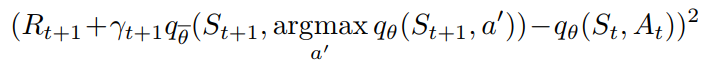
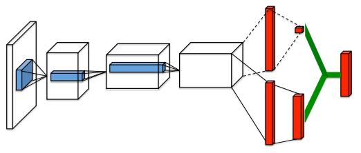
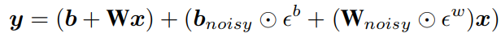
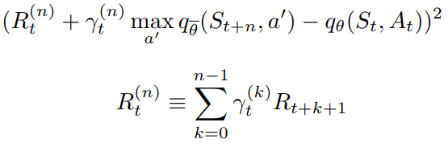
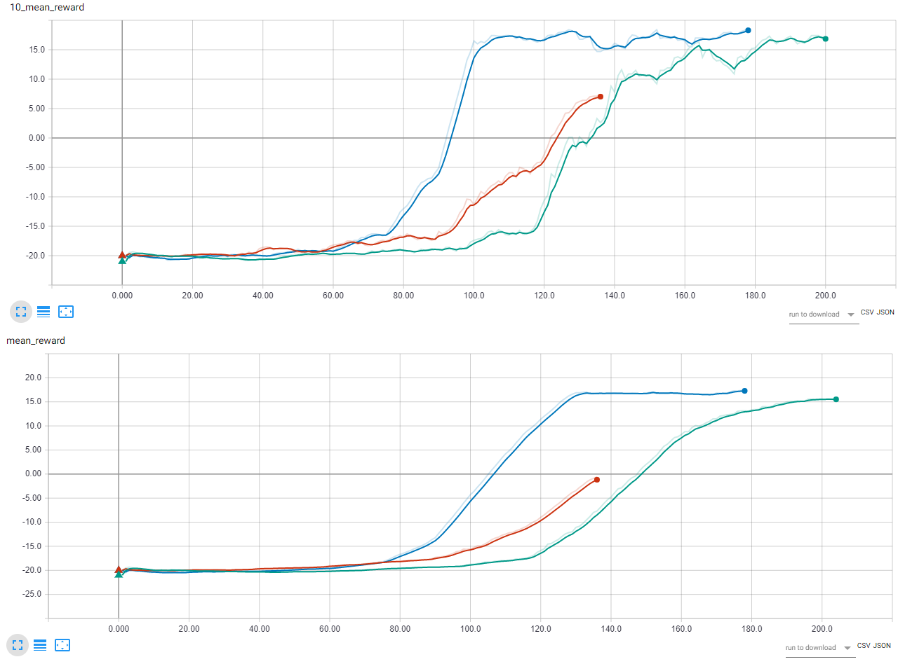

# DQN, Double Q-learning, Deuling Networks, Multi-step learning and Noisy Nets applied to Pong

This week we will apply Deep Q-Networks (DQN) to [Pong](https://gym.openai.com/envs/Pong-v0/).


For the DQN implementation and the choose of the hyperparameters, I mostly followed [Mnih et al.](https://storage.googleapis.com/deepmind-media/dqn/DQNNaturePaper.pdf). (In the last page there is a table with all the hyperparameters.)

To make things more interesting, I improved the basic DQN, implementing some variations like **Double Q-learning**, **Dueling networks**, **Multi-step learning** and **Noisy Nets**. You can find them summarized by [Hessel et al.](https://arxiv.org/pdf/1710.02298.pdf)

### [Learn the theory](../README.md)

---

### Double Q-learning - [Paper](https://arxiv.org/pdf/1509.06461.pdf)

Minimize the overestimation bias introduced by the conventional Q-learning.



To use it, in *main.py*, set
```python
DQN_HYPERPARAMS = {
    'double_DQN': True,
    ...
}
```

---

### Dueling networks - [Paper](http://proceedings.mlr.press/v48/wangf16.pdf)

It uses two different neural networks, one outputs the value of the state and the other the advantage of each action.
The two NNs share the convolutional encoder.



To use it, in *main.py*, set
```python
DQN_HYPERPARAMS = {
    'dueling': True,
    ...
}
```

---

### NoisyNet - [Paper](https://arxiv.org/pdf/1706.10295.pdf)

An idea to overcome the ε-greedy limitations is to introduce noise linear layers. The network will manage the noise stream to balance the exploration.



To use it, in *main.py*, set
```python
DQN_HYPERPARAMS = {
    'noisy_net': True,
    ...
}
```

---

### Multi-step

Introduce a forward-view multi-step. Similar to TD(λ)




To use it, in *main.py*, set
```python
DQN_HYPERPARAMS = {
    'n_multi_step': 2, # or 3
    ...
}
```

NB: From today's on, because we will train deep neural networks, I suggest to run the code on GPUs. If you don't have it, you can use [Google Colab](https://colab.research.google.com/).
Also, to track the networks' results, we'll use [TensorboardX](https://github.com/lanpa/tensorboardX) (tensorboard for PyTorch). In case you use Google Colab to run TensorBoard on your pc, execute the commands in the section below.

NB: If you use GPUs remember to change DEVICE from 'cpu' to 'cuda' in *main.py*.


## To make the code more clear, it's structured in 6 files:
 - **main.py** contains the main body. It creates the agent, the environment and plays N games. For each step, it updates the agent
 - **agents.py** has the Agent class that control the central control, the replay buffer and basic functions
 - **central_control.py** contains CentralControl class. It is responsible to instantiate the DQN (or its variants), optimize it, calculate the loss ecc..
 - **buffers.py** contains the ReplayBuffer class to keep the agent's memories inside a deque list and sample from it.
 - **neural_net.py** contains the deep neural nets for the agent namely DQN, DuelingDQN and a NoisyLinear Layer for the Noisy DQN.
 - **atari_wrappers.py** include some Atari wrappers. https://github.com/openai/baselines/blob/master/baselines/common/atari_wrappers.py
 - **utils.py**, for now, contains only a testing function.


## Results

In the image below are shown the rewards mean of the last 10 games and the last 40 games for three different DQN variations.
The x-axis is the number of games. You can see that only 120 games are enough to learn the game pretty well.



-  `Basic DQN`
-  `2-step DQN`
-  `2-step Dueling DQN`

May seem strange that 2-step Dueling DQN performs worst than 2-step DQN but it's important to keep in mind that the NNs are stochastic and that I tested only on one game. The authors of the DuelingDQN paper, reported better results when applied to other games.


## Install

```
!pip install gym
!pip install torch torchvision
!pip install tensorboardX
!apt-get install -y python-numpy python-dev cmake zlib1g-dev libjpeg-dev xvfb ffmpeg xorg-dev python-opengl libboost-all-dev libsdl2-dev swig
```

Install gym
```
!git clone https://github.com/openai/gym.git
import os
os.chdir('gym')
!ls
!pip install -e .
os.chdir('..')
```

Install gym
```
!pip install gym[atari]
```


## To run TensorBoard in Google Colab

Instructions from https://www.dlology.com/blog/quick-guide-to-run-tensorboard-in-google-colab/

Download and install ngrok
```
!wget https://bin.equinox.io/c/4VmDzA7iaHb/ngrok-stable-linux-amd64.zip
!unzip ngrok-stable-linux-amd64.zip
```

run ngrok and tensorboard
```
LOG_DIR = 'content/runs'

get_ipython().system_raw(
    'tensorboard --logdir {} --host 0.0.0.0 --port 6006 &'.format(LOG_DIR)
)

get_ipython().system_raw('./ngrok http 6006 &')

!curl -s http://localhost:4040/api/tunnels | python3 -c \
    "import sys, json; print(json.load(sys.stdin)['tunnels'][0]['public_url'])"
```
