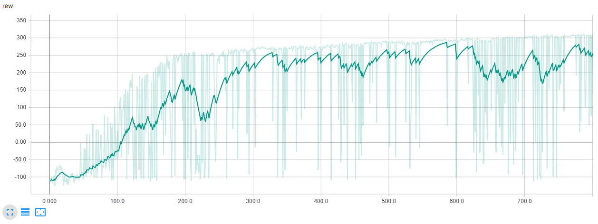

# Let's solve BipedalWalker with PPO

This is an implementation of [PPO](https://blog.openai.com/openai-baselines-ppo/) with continuous actions, a new algorithm developed by OpenAI that has been used in [OpenAI Five to play Dota 2](https://blog.openai.com/openai-five/).

PPO is a policy gradient method that differently from the vanilla implementation, it combines the sampling data through interaction with the environment and the optimization of a surrogate objective function. Read the [paper](https://arxiv.org/pdf/1707.06347.pdf) to learn more about it.

For the DQN implementation and the choose of the hyperparameters, I mostly followed the [paper](https://arxiv.org/pdf/1707.06347.pdf). (In the last page there is a table with all the hyperparameters.). In case you want to fine-tune them, check out [Training with Proximal Policy Optimization](https://github.com/Unity-Technologies/ml-agents/blob/master/docs/Training-PPO.md)

### [Learn the theory behind PPO](https://github.com/andri27-ts/60_Days_RL_Challenge/blob/master/README.md#week-5---advanced-policy-gradients---trpo--ppo)


## Results


In the plot below are shown the rewards. The game defines "solving" as getting an average reward of 300 over 100 consecutive trials. We aren't at that level yet, but is possible to reach that goal tuning the hyperparameters and playing more episodes.




## Install

```
pip install gym
pip install torch torchvision
pip install tensorboardX
apt-get install -y python-numpy python-dev cmake zlib1g-dev libjpeg-dev xvfb ffmpeg xorg-dev python-opengl libboost-all-dev libsdl2-dev swig

git clone https://github.com/pybox2d/pybox2d
cd pybox2d
!pip install -e .
```
