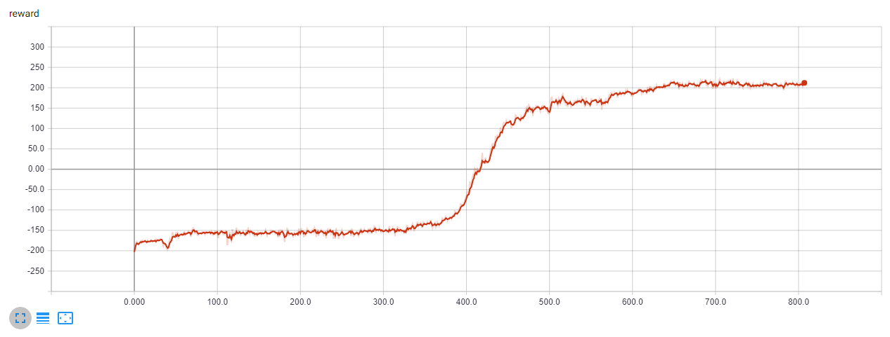

# Scalable Evolution Strategies on LunarLander

Evolution Strategies is a valid alternative to the most popular MDP-based RL techniques. Here is provided an implementation of the OpenAI paper [Evolution Strategies as a
Scalable Alternative to Reinforcement Learning](https://arxiv.org/pdf/1703.03864.pdf). I decided to test it on [LunarLander](https://gym.openai.com/envs/LunarLanderContinuous-v2/) Gym environment to show the applicability and competitiveness of this category of algorithms.

The following are the key parts of this implementation:
- Novel communication strategy based on common random number
- Mirrored sampling
- Normalized rank


### [Learn more about Evolution Strategies](https://github.com/andri27-ts/60_Days_RL_Challenge#week-6---evolution-strategies-and-genetic-algorithms)


## Results


The following plot shows the reward for each iteration. ES is able to solve the game after 650 iterations. Keep in mind that in this version, for each iteration, 100 games are played. This means that the algorithm solved the gamed after having played about 65.000 games.




## Install

```
pip install gym
pip install torch torchvision
pip install tensorboardX
apt-get install -y python-numpy python-dev cmake zlib1g-dev libjpeg-dev xvfb ffmpeg xorg-dev python-opengl libboost-all-dev libsdl2-dev swig

git clone https://github.com/pybox2d/pybox2d
cd pybox2d
pip install -e .
```
