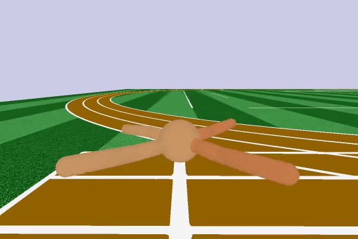

# Model-Based Reinforcement Learning

The strength of model-based reinforcement learning algorithms is that, once they learned the environment, they can plan the next actions to take. This allows the agent to transfer the knowledge of the environment it has acquired to other tasks. Model-based methods generally are more sample efficient than model-free to the detriment of performance.
Better and more efficient RL algorithms can be obtained merging these two techniques.
This repository contains an implementation of the model-based algorithm proposed in section IV of [this paper](https://arxiv.org/pdf/1708.02596.pdf) with some differences:
- used [Roboschool](https://github.com/openai/roboschool) instead of [Mujoco](http://www.mujoco.org/).
- along with the next environment state, also the reward is learned. To do that another neural network has been used.
- hyperparameters have been adapted to the new environment and problem reformulation (i.e. the reward has to be learned).

The pseudocode of the main loop is the following:


### [Learn more about Model-Based Reinforcement Learning](https://github.com/andri27-ts/60_Days_RL_Challenge#week-7---model-based-reinforcement-learning)

## Results



To train RoboschoolAnt-v1, no aggregation steps has been used.
On RoboschoolAnt, playing 10.000 games it achieves a mean reward of about 800. These games have been played only taking random actions.


## Install

Roboschool installation:
```
apt install cmake ffmpeg pkg-config qtbase5-dev libqt5opengl5-dev libassimp-dev libpython3.6-dev libboost-python-dev libtinyxml-dev

git clone https://github.com/openai/gym
pip install -e gym

git clone https://github.com/openai/roboschool

cd roboschool
ROBOSCHOOL_PATH=`pwd`
git clone https://github.com/olegklimov/bullet3 -b roboschool_self_collision
mkdir bullet3/build
cd    bullet3/build
cmake -DBUILD_SHARED_LIBS=ON -DUSE_DOUBLE_PRECISION=1 -DCMAKE_INSTALL_PREFIX:PATH=$ROBOSCHOOL_PATH/roboschool/cpp-household/bullet_local_install -DBUILD_CPU_DEMOS=OFF -DBUILD_BULLET2_DEMOS=OFF -DBUILD_EXTRAS=OFF  -DBUILD_UNIT_TESTS=OFF -DBUILD_CLSOCKET=OFF -DBUILD_ENET=OFF -DBUILD_OPENGL3_DEMOS=OFF ..
make -j4
make install
cd ../..


pip3 install -e $ROBOSCHOOL_PATH
```

Torch installation:
```
pip install torch torchvision
```

In case you use Google Colab, run

```
# Install Chainer, ChainerRL and CuPy!

%%script bash

apt-get -qq -y install libcusparse8.0 libnvrtc8.0 libnvtoolsext1 > /dev/null
ln -snf /usr/lib/x86_64-linux-gnu/libnvrtc-builtins.so.8.0 /usr/lib/x86_64-linux-gnu/libnvrtc-builtins.so
pip -q install https://github.com/kmaehashi/chainer-colab/releases/download/2018-02-06/cupy_cuda80-4.0.0b3-cp36-cp36m-linux_x86_64.whl
pip -q install 'chainer==4.0.0b3'
apt-get -qq -y install xvfb freeglut3-dev ffmpeg> /dev/null
pip -q install chainerrl
pip -q install gym
pip -q install pyglet
pip -q install pyopengl
pip -q install pyvirtualdisplay
```
